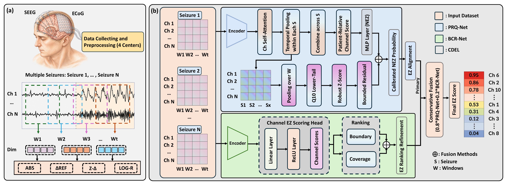

# EpiLENS

Official implementation of **EpiLENS: Patient-Relative Epileptogenic Zone Localization from Multi-Center Intracranial EEG**.

[Project page](https://gifoe.github.io/EpiLENS/) | [arXiv](https://arxiv.org/abs/2608.01076) | [PDF](https://arxiv.org/pdf/2608.01076)

EpiLENS localizes epileptogenic-zone (EZ) contacts from heterogeneous multi-center intracranial EEG. It builds patient-relative evidence from repeated seizures and combines two independently trained branches:

- **PRQ-Net** models seizure-consistent deviations from each patient's internal electrophysiological reference.
- **BCR-Net** emphasizes difficult EZ/NEZ boundaries and patient-level ranking.
- **CDEL** conservatively fuses the two branches with the locked rule `0.8 * PRQ-Net + 0.2 * BCR-Net`.

## Main result

Metrics are patient-wise and then macro-averaged across 80 postoperative seizure-free patients. Values are mean +/- standard deviation over three seeds.

| Method | Macro-F1 | EZ-F1 | AUROC | EZ-frac. bias |
|---|---:|---:|---:|---:|
| Logistic regression + patient-wise z-score | 0.6065 +/- 0.0000 | 0.3988 +/- 0.0000 | 0.6835 +/- 0.0000 | -0.0138 |
| PRQ-Net | 0.6282 +/- 0.0018 | 0.4299 +/- 0.0035 | 0.7416 +/- 0.0007 | -0.0097 |
| BCR-Net | 0.6248 +/- 0.0024 | 0.4303 +/- 0.0083 | 0.7392 +/- 0.0034 | +0.0040 |
| **CDEL** | **0.6371 +/- 0.0072** | **0.4485 +/- 0.0118** | **0.7468 +/- 0.0004** | **+0.0034** |

The repository retains the strongest reported baseline only: logistic regression with label-free patient-wise feature z-scoring.

## Project figures

### Framework overview



[Download the original framework PDF](docs/assets/aoa.pdf)

The previews above render directly on the GitHub code page; the PDF links retain
the original vector-quality figures.

## Transfer to a conventional model

Patient-wise z-score normalization is a label-free EpiLENS module rather than a
model-specific trick. Adding it to ordinary logistic regression raises Macro-F1
from **0.4910 to 0.6065**, EZ-F1 from **0.2740 to 0.3988**, and AUROC from
**0.5930 to 0.6835** under the same patient-wise evaluation protocol.

## Installation

Python 3.10 or newer is required.

```bash
python -m venv .venv
# Windows: .venv\Scripts\activate
# Linux/macOS: source .venv/bin/activate
python -m pip install --upgrade pip
python -m pip install -e ".[test]"
```

Run the unit tests:

```bash
python -m pytest
```

## Input contract

Clinical recordings are not distributed in this repository. The training scripts consume two explicit inputs:

1. `records.pkl`: a list of dictionaries compatible with `epilens.data.PatientRecord`.
2. `partition_manifest.csv`: fixed patient-wise outer-fold assignments.

Each patient record contains:

| Field | Shape / type | Meaning |
|---|---|---|
| `patient_id` | string | Anonymized patient identifier |
| `center` | string | Center identifier |
| `descriptors` | `[seizure, window, channel, 9]` | Spectral and waveform descriptors |
| `window_times` | `[seizure, window]` | Seconds relative to seizure onset |
| `valid` | `[seizure, window, channel]` | Valid-observation mask |
| `channel_names` | sequence of strings | Anonymized channel identifiers |
| `label_nez` | `[channel]` | Label convention: NEZ = 1, EZ = 0 |

The manifest must contain `patient_id`, `outer_fold`, and `partition`, where `partition` is one of `fit`, `validation`, or `test`. The loader also accepts `fold_idx` as an alias for `outer_fold`. Protocol validation fails if patients overlap across partitions or do not appear exactly once in the outer-test folds.

## Core commands

Train the two branches with the fixed patient partitions:

```bash
python scripts/train_prq_net.py \
  --records records.pkl \
  --partition-manifest partition_manifest.csv \
  --output-directory outputs/prq

python scripts/train_bcr_net.py \
  --records records.pkl \
  --partition-manifest partition_manifest.csv \
  --output-directory outputs/bcr
```

Evaluate the locked CDEL fusion:

```bash
python scripts/evaluate_cdel.py \
  --prq-directory outputs/prq \
  --bcr-directory outputs/bcr \
  --output-directory outputs/cdel
```

Run the retained strongest baseline:

```bash
python scripts/run_best_baseline.py \
  --records records.pkl \
  --partition-manifest partition_manifest.csv \
  --output-directory outputs/baseline
```

Additional scripts reproduce component ablations, quantile sensitivity, fusion statistics, cross-seizure analysis, and leave-one-center-out evaluation. See [`experiment_index.py`](experiment_index.py) for the executable index.

## Data and privacy

The study uses sensitive clinical iEEG. Raw recordings, patient identifiers, and site-confidential annotations are not included. Users must obtain data access from the corresponding data custodians and prepare anonymized records that satisfy the input contract above.

## Citation

```bibtex
@article{gong2026epilens,
  title   = {EpiLENS: Patient-Relative Epileptogenic Zone Localization from Multi-Center Intracranial EEG},
  author  = {Gong, Yuanchu and Yan, Zibo and Lyu, Yibo and Chen, Chen and Chan, Sixian and Wang, Yalin},
  journal = {arXiv preprint arXiv:2608.01076},
  year    = {2026},
  doi     = {10.48550/arXiv.2608.01076}
}
```
